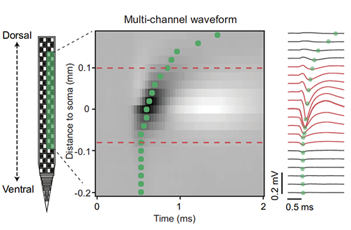
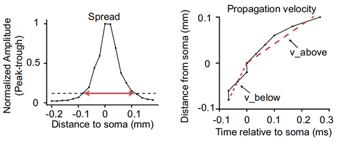

# waveform_classification
Discription: Waveform classifcation with extracellular recordings in mouse brain using Neuropixels probes

This repo include supplemental materials, data and code used in JNP paper:

Source: [Jia et al. (2019) "High-density extracellular probes reveal dendritic backpropagation and facilitate neuron classification." _J Neurophys_ **121**: 1831-1847](https://doi.org/10.1152/jn.00680.2018)
  

Data includes:
>    1. multi-channel waveforms
>    2. single-channel waveforms
>    3. extracted features and cluster labels
>    4. velocity profiles

**1D waveform features**: Waveform duration, peak-trough ratio, repolarization slope, and recovery slope.

**Example 2D waveform**: Signals from channels along one edge of the probe are smoothed with a moving average to create the 2D waveform. Green dots indicate the location of the waveform trough on each channel.

**2D waveform features**: Waveform spread, velocity above the soma, and velocity below the soma.

Codes used to process multi-channel waveform features and quality metrics are in the ecephys_spike_sorting repo:
https://github.com/AllenInstitute/ecephys_spike_sorting/tree/master/ecephys_spike_sorting/modules/mean_waveforms

The quality metrics and waveform features developed in this paper are included in the unit_table of publicly released Neuropixels dataset, which can be accessed through AllenSDK:
https://github.com/AllenInstitute/AllenSDK/tree/master/allensdk/brain_observatory/ecephys

